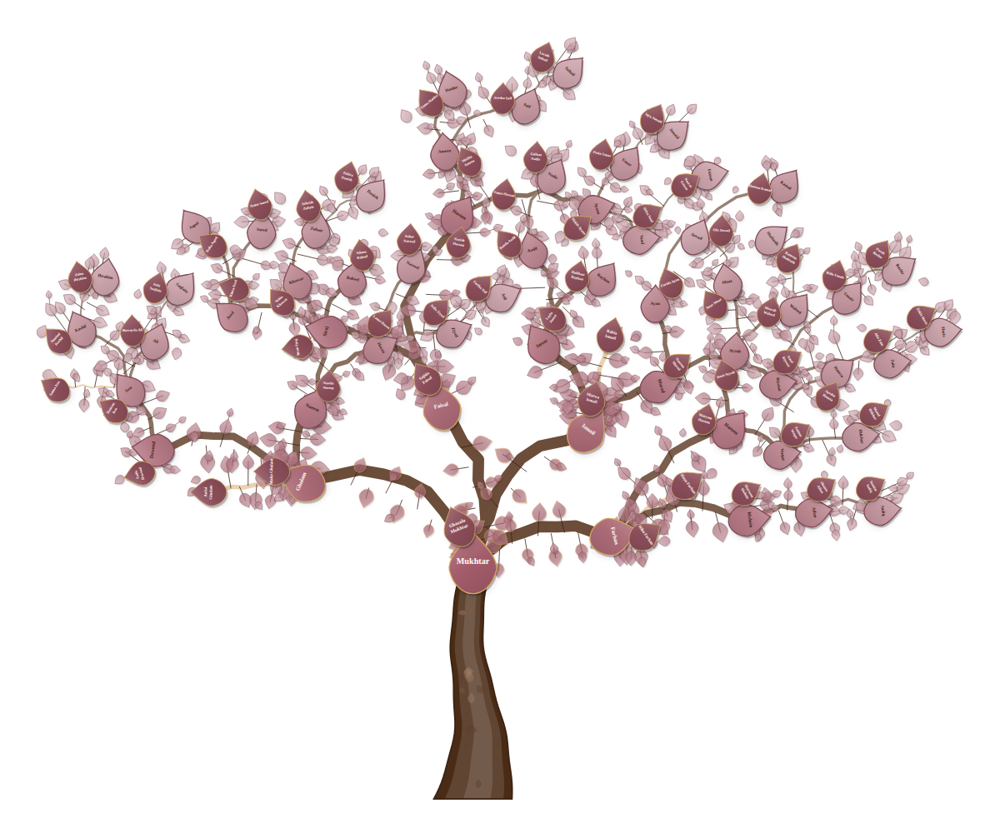
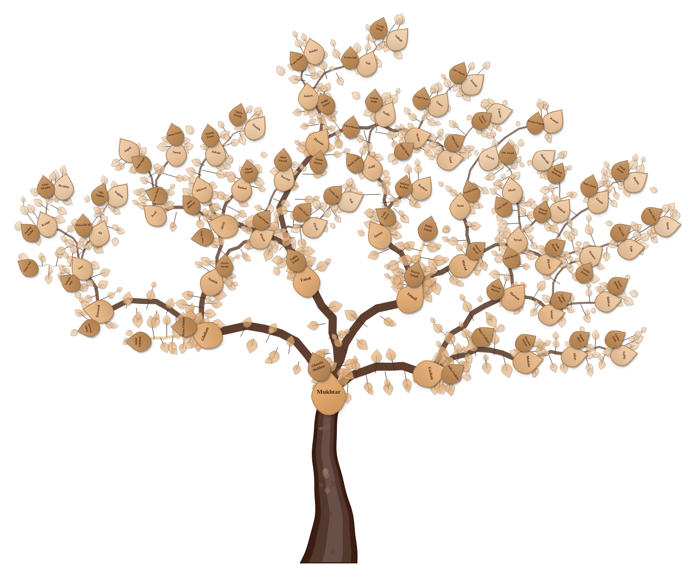
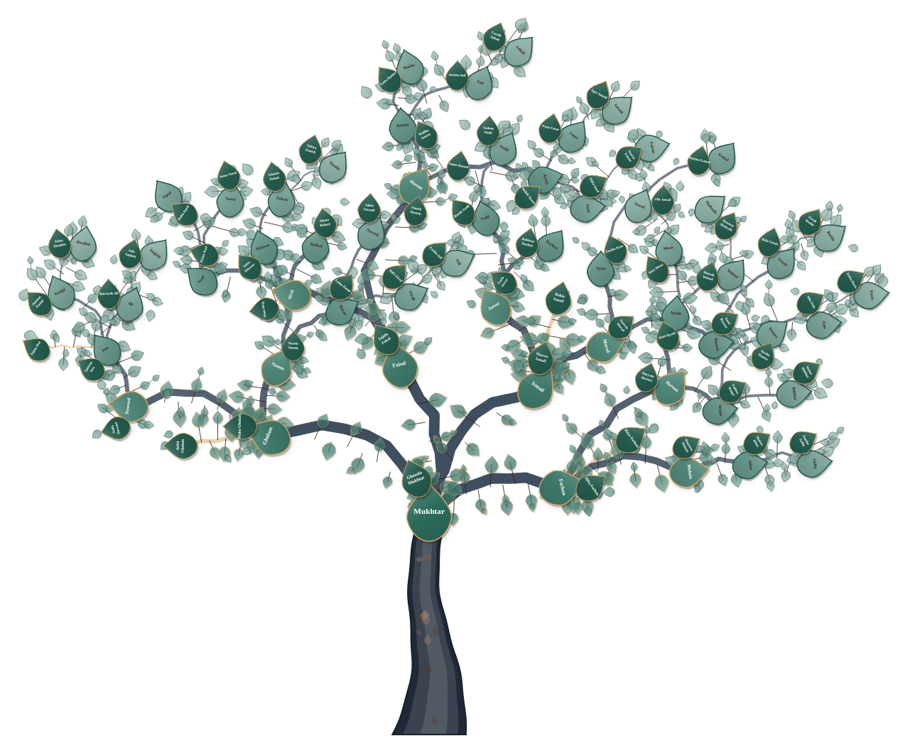
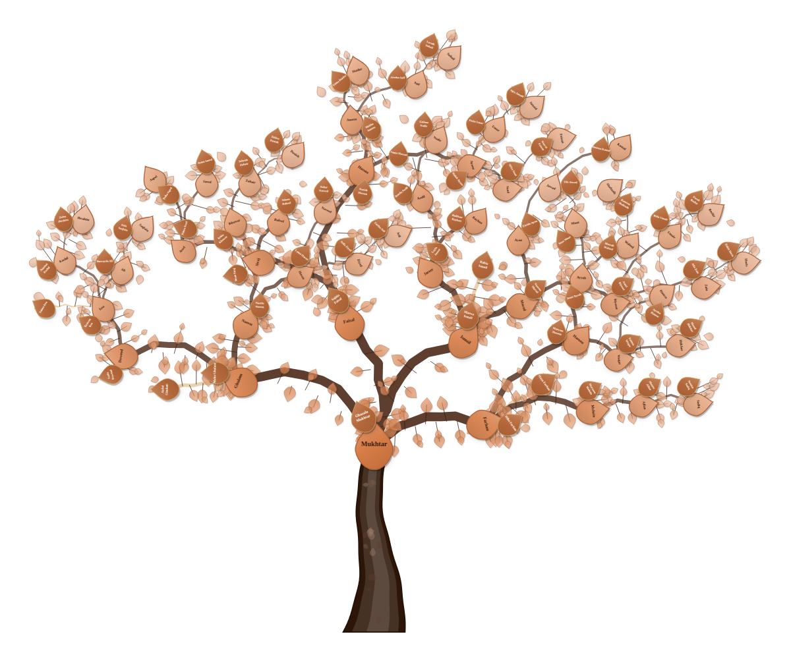

# family-tree-svg

<p align="center">
  
</p>

Pure organic SVG family tree visualization from JSON data — featuring customizable **branch styles**, **trunk styles**, **3 distinct leaf shapes**, **PNG leaf assets**, dynamic colors, pan/zoom, and vector export.

---

### 🎨 Color Themes & Palettes

Dynamic coordinated color presets and full custom hex support:

<table>
  <tr>
    <td align="center" width="50%">
      <b>🌸 Cherry Blossom</b><br/><br/>
      <br/>
      <code>leaf: #a35c6a</code> &bull; <code>branch: #5e3b25</code> &bull; <code>trunk: #4a2c16</code>
    </td>
    <td align="center" width="50%">
      <b>🍂 Golden Autumn</b><br/><br/>
      <br/>
      <code>leaf: #dfa467</code> &bull; <code>branch: #4d2b1a</code> &bull; <code>trunk: #3d1d11</code>
    </td>
  </tr>
  <tr>
    <td align="center" width="50%">
      <b>❄️ Winter Pine</b><br/><br/>
      <br/>
      <code>leaf: #2a6b5c</code> &bull; <code>branch: #2d3e50</code> &bull; <code>trunk: #1f2937</code>
    </td>
    <td align="center" width="50%">
      <b>🌅 Sunset Clay</b><br/><br/>
      <br/>
      <code>leaf: #d67b45</code> &bull; <code>branch: #4d2b1a</code> &bull; <code>trunk: #2d1607</code>
    </td>
  </tr>
</table>

---

## Features

- 🌿 **3 Distinct Branch Styles** — `woodcut` (living sap lines), `gnarled` (rustic knots), and `classic` (smooth calligraphic curves)
- 🌳 **3 Organic Trunk Styles** — `earth_roots` (4-root buttress), `gnarly` (ancient oak), and `swirling_olive` (spiral knurls)
- 🍃 **3 Botanical Leaf Shapes** — `laurel` (Classical Laurel), `oval` (Imperial Oval Medallion), and `oak` (Royal Oak Foliage)
- 🖼️ **Dual Leaf Render Modes** — Pure Vector SVG path mode or high-resolution textured PNG image mode with pre-rendered transparent assets (`leaf_laurel.png`, `leaf_oval.png`, `leaf_oak.png`)
- 🎨 **Fully Customizable Colors** — Set custom hex colors for leaves, branches, and trunk
- 🖱️ **Pan & Zoom** — Smooth drag-to-pan, mouse wheel zoom, and mobile touch support
- ➕➖ **Collapse/Expand** — Interactive branch collapse/expand buttons
- 👫 **Partner Support** — Spouses shown as attached companion leaves
- ⚡ **Auto-Collapse** — Large trees (500+ members) automatically collapse deeper branches for clean rendering
- 📤 **SVG Export** — Download your tree as a clean vector SVG
- 🪶 **Zero UI Clutter** — Pure tree component without unnecessary toolbars or widgets

---

## Installation

### Via Script Tag (Direct / CDN)

```html
<script src="path/to/family-tree-svg/src/family-tree-svg.js"></script>
```

### Via npm

```bash
npm install family-tree-svg
```

```javascript
// CommonJS
const FamilyTreeSVG = require('family-tree-svg');

// ES Module
import FamilyTreeSVG from 'family-tree-svg';
```

---

## Quick Start

```html
<!DOCTYPE html>
<html>
<head>
  <style>
    body { margin: 0; }
    #tree-container { width: 100vw; height: 100vh; }
  </style>
</head>
<body>
  <div id="tree-container"></div>

  <script src="src/family-tree-svg.js"></script>
  <script>
    const familyData = {
      full_name: "Ahmed Khan",
      family_name: "Khan",
      partners: [{ full_name: "Fatima Ahmed", family_name: "Khan" }],
      children: [
        {
          full_name: "Yusuf Ahmed",
          family_name: "Khan",
          partners: [{ full_name: "Ayesha Yusuf", family_name: "Khan" }],
          children: [
            { full_name: "Hamza Yusuf", family_name: "Khan", partners: [], children: [] }
          ]
        }
      ]
    };

    // Initialize with custom styling
    const tree = FamilyTreeSVG.create('#tree-container', familyData, {
      branchStyle: 'woodcut',      // 'woodcut' | 'gnarled' | 'classic'
      trunkStyle: 'calligraphic',  // 'calligraphic' | 'gnarled_veteran'
      leafStyle: 'laurel',         // 'laurel' | 'oval' | 'oak'
      leafRenderMode: 'svg',       // 'svg' | 'png'
      leafColor: '#17361a',
      branchColor: '#3a1f13',
      trunkColor: '#2d1607'
    });
  </script>
</body>
</html>
```

---

## Style Catalog

### 🌿 Branch Styles (`branchStyle`)

| Style | Key | Description |
|---|---|---|
| **Woodcut Sap (Default)** | `'woodcut'` | Layered bark contours, warm heartwood inner core, living gold sap lines (`.woodcut-sap-line`), and smooth collar joints |
| **Gnarled Rustic** | `'gnarled'` | Organic winding branches with knot deflections, high sweep amplitude, and rustic bark ridges |
| **Classic Smooth** | `'classic'` | Minimalist, smooth calligraphic curved boughs |

### 🌳 Trunk Styles (`trunkStyle`)

| Style | Key | Description |
|---|---|---|
| **Elegant S-Curve (Default / Original)** | `'calligraphic'` | The iconic calligraphic S-curve trunk with 3D layered shading (dark base, mid-tone heartwood, highlight streak), subtle wood knots, and right-flank gold light reflection |
| **Gnarled Knotted Veteran** | `'gnarled_veteran'` | Rugged winding trunk with weathered S-curve lean, asymmetric windward anchor root foot, carved wood knot burl ("tree eye"), and matching 3D layered shading |

### 🍃 Leaf Shapes (`leafStyle`)

| Shape | Key | Description |
|---|---|---|
| **Classical Laurel (Default)** | `'laurel'` | Pointed symmetric botanical elliptic leaf with tapered tips and gold midrib vein (0% heart shape) |
| **Imperial Oval Medallion** | `'oval'` | Continuous rounded heraldic badge / medallion with spacious text area and double gold rim |
| **Royal Oak Foliage** | `'oak'` | Distinctive lobed foliage with undulating rounded lobes and apical crown lobe |

### 🖼️ Leaf Render Modes (`leafRenderMode`)

- `'svg'` *(default)*: Renders dynamic SVG paths with gradients, drop shadows, and delicate gold vein lines.
- `'png'`: Uses pre-rendered high-resolution transparent PNG leaf assets (`assets/leaf_laurel.png`, `assets/leaf_oval.png`, `assets/leaf_oak.png`) with crisp text overlays.

---

## API Reference

### `FamilyTreeSVG.create(container, data, options)`

Creates and returns a new `FamilyTreeSVG` instance.

#### Options

| Option | Type | Default | Description |
|---|---|---|---|
| `branchStyle` | `string` | `'woodcut'` | Branch style: `'woodcut'`, `'gnarled'`, or `'classic'` |
| `trunkStyle` | `string` | `'calligraphic'` | Trunk style: `'calligraphic'` or `'gnarled_veteran'` |
| `leafStyle` | `string` | `'laurel'` | Leaf shape: `'laurel'`, `'oval'`, or `'oak'` |
| `leafRenderMode` | `string` | `'svg'` | Leaf mode: `'svg'` (vector paths) or `'png'` (image assets) |
| `leafPngUrls` | `Object` | *built-in* | Map of leaf styles to custom PNG URLs |
| `leafColor` | `string` | `'#17361a'` | Hex color for leaves |
| `branchColor` | `string` | `'#3a1f13'` | Hex color for branches |
| `trunkColor` | `string` | `'#2d1607'` | Hex color for trunk |

---

### Instance Methods

#### `tree.setBranchStyle(style)`
Switches the branch rendering style (`'woodcut'`, `'gnarled'`, `'classic'`).

#### `tree.setTrunkStyle(style)`
Switches the trunk style (`'earth_roots'`, `'gnarly'`, `'swirling_olive'`).

#### `tree.setLeafStyle(style)`
Switches the leaf shape (`'laurel'`, `'oval'`, `'oak'`).

#### `tree.setLeafRenderMode(mode, urls)`
Switches between `'svg'` vector and `'png'` image rendering.

#### `tree.setStyles({ branchStyle, trunkStyle, leafStyle, leafRenderMode })`
Applies multiple style changes simultaneously and re-renders once.

#### `tree.setColors(leafColor, branchColor, trunkColor)`
Updates the color palette and re-renders dynamically.

#### `tree.fitView(smooth)`
Centers and fits the entire tree inside the container viewport.

#### `tree.loadData(newData)`
Loads a new JSON dataset and fits view.

#### `tree.exportSVG()`
Downloads the current tree as a standalone vector `.svg`.

#### `tree.destroy()`
Cleans up event listeners and empties the container DOM.

---

## License

MIT
