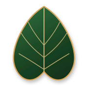
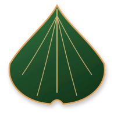
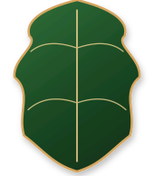
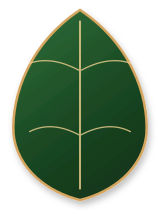
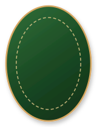
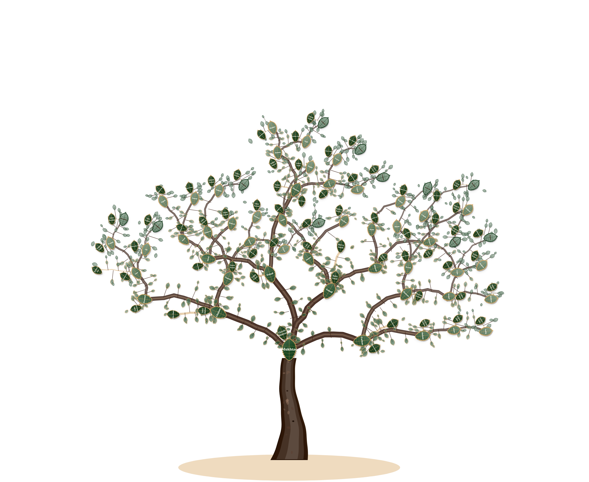
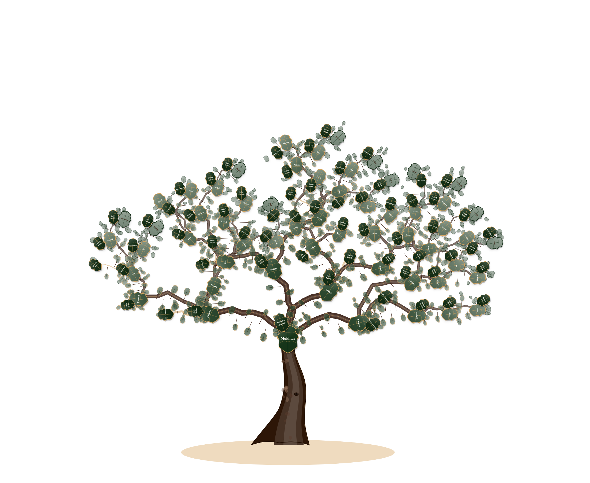
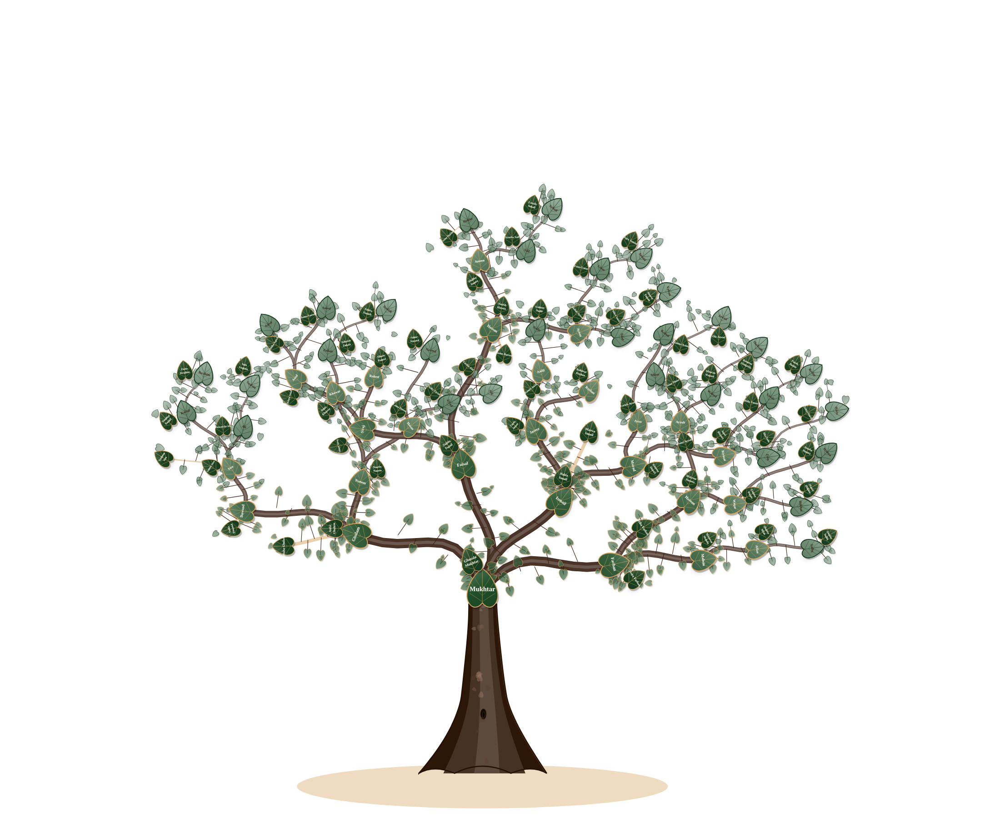
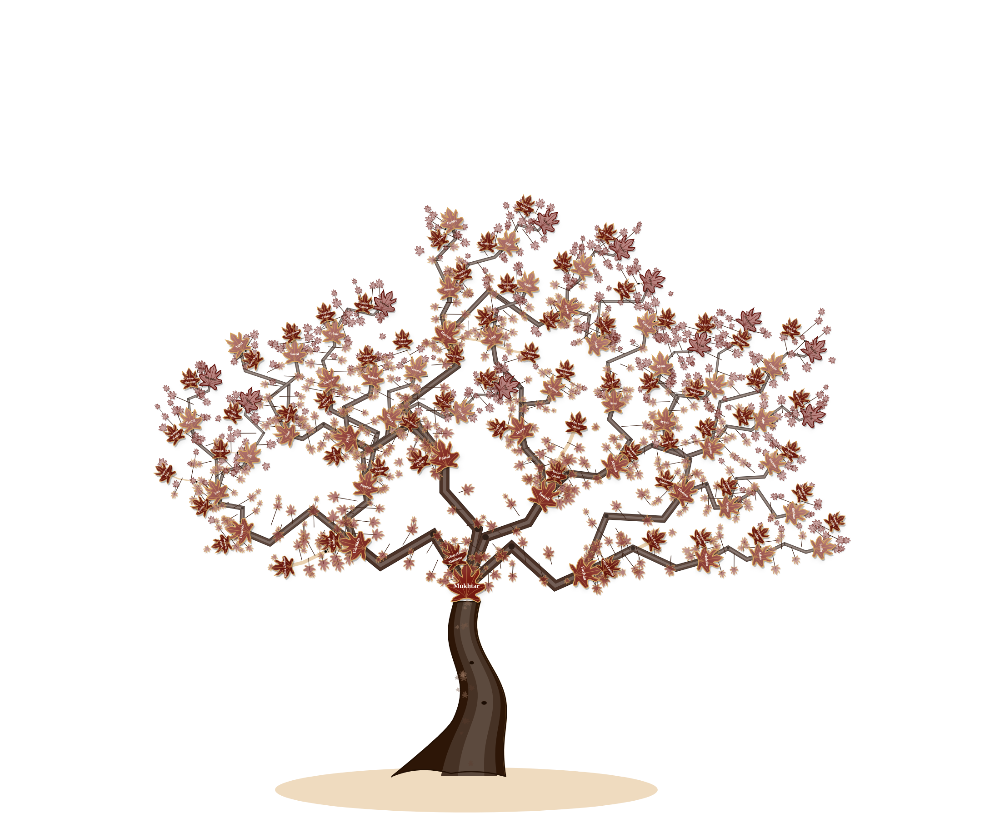

# 🌳 FamilyTreeSVG — Visual Style & Botanical Catalog

Welcome to the **FamilyTreeSVG** visual catalog. This document presents the custom **standalone Leaf SVGs** and **Whole-Tree Branch Architectures** available in the package.

---

## 🍃 1. Standalone Botanical Leaf SVGs (Pure Vector — Zero Background)

All leaves are available as **pure vector SVGs with 100% transparent backgrounds** (no cards, no container boxes, no borders). They scale infinitely with crisp gold venation rays and double accent borders:

<p align="center">
  
  &nbsp;&nbsp;&nbsp;&nbsp;
  
  &nbsp;&nbsp;&nbsp;&nbsp;
  
  &nbsp;&nbsp;&nbsp;&nbsp;
  
  &nbsp;&nbsp;&nbsp;&nbsp;
  
  &nbsp;&nbsp;&nbsp;&nbsp;
  
  &nbsp;&nbsp;&nbsp;&nbsp;
  
</p>

### 🔍 Leaf SVG Botanical Anatomy Table

| Preview (SVG) | Leaf Style | Key | Botanical Anatomy | Venation Details |
|:---:|---|---|---|---|
|  | **🍁 Japanese Maple** | `'maple'` / `'japanese_maple'` | 7 radiating needle-sharp slender lobes, deep curved sinuses with concave relief | 7-ray palmate gold venation diverging from petiole base |
|  | **🍃 Serrated Birch / Elm** | `'birch'` / `'serrated_birch'` | Natural fine saw-tooth perimeter notches, tapered acute apex pointing upwards | Alternating herringbone pinnate gold veins |
|  | **💚 Cordate Linden** | `'linden'` / `'cordate_linden'` | Deep heart-cleft basal notch seating firmly onto branch collars with acute drip-tip | Radiating palmate-pinnate gold venation |
|  | **🪭 Majestic Ginkgo** | `'ginkgo'` | Flared fan contour with sharp apex point staying on upper side (pointing upwards!) | Radial fan gold veins radiating along fan base |
|  | **🌳 Royal Oak** | `'oak'` | Classical lobed crown foliage with undulating rounded sinusoidal lobes | Central midrib with ascending curved secondary veins |
|  | **🍃 Classical Laurel** | `'laurel'` | Pointed symmetric botanical elliptic leaf with tapered tips (0% heart shape) | Central midrib with 4 symmetric lateral pinnate veins |
|  | **🟢 Imperial Oval** | `'oval'` | Continuous rounded heraldic badge / medallion with spacious text area | Delicate dashed concentric gold inner rim |

---

## 🌲 2. Whole-Tree Branch Architectures (50-Person Family — Zero Background)

Each branch style is demonstrated with a **full ~50-person family tree structure** (based on `khan_tree (4).svg`), creating an authentic, expansive, and natural canopy dome across all boughs, joints, and tiers. Rendered **completely without background** (pure vector SVG & transparent PNG):

---

### 🪵 A. Woodcut Sap Organic (`branchStyle: 'woodcut'`)

> Layered bark contours, warm heartwood inner core, and living gold sap lines (`.woodcut-sap-line`) with smooth collar joints. Paired with 🍃 **Serrated Birch** leaves.



📄 **Vector Asset**: [`assets/tree_woodcut_sap.svg`](assets/tree_woodcut_sap.svg) *(100% scalable pure vector SVG with zero background)*

```javascript
const tree = FamilyTreeSVG.create('#container', familyData50, {
  branchStyle: 'woodcut',
  leafStyle: 'birch',
  trunkStyle: 'calligraphic'
});
```

---

### 🌲 B. Gnarled Rustic (`branchStyle: 'gnarled'`)

> Organic winding boughs with high sweep amplitude, rugged bark ridges, and natural knot deflections. Paired with 🌳 **Royal Oak** leaves.



📄 **Vector Asset**: [`assets/tree_gnarled_rustic.svg`](assets/tree_gnarled_rustic.svg) *(100% scalable pure vector SVG with zero background)*

```javascript
const tree = FamilyTreeSVG.create('#container', familyData50, {
  branchStyle: 'gnarled',
  leafStyle: 'oak',
  trunkStyle: 'gnarled_veteran'
});
```

---

### 🌿 C. Flowing Willow Tendril (`branchStyle: 'willow_tendril'`)

> Gracefully weeping S-curve boughs, soft drooping droop offsets, and braided double bark contour lines. Paired with 💚 **Cordate Linden** leaves.



📄 **Vector Asset**: [`assets/tree_willow_tendril.svg`](assets/tree_willow_tendril.svg) *(100% scalable pure vector SVG with zero background)*

```javascript
const tree = FamilyTreeSVG.create('#container', familyData50, {
  branchStyle: 'willow_tendril',
  leafStyle: 'linden',
  trunkStyle: 'banyan_cathedral'
});
```

---

### 🎋 D. Faceted Zen Bonsai (`branchStyle: 'zen_bonsai'`)

> Sculpted angular mitered facet boughs, chamfered corner nodes, and geometric Zen aesthetic. Paired with 🍁 **Japanese Maple** leaves.



📄 **Vector Asset**: [`assets/tree_zen_bonsai.svg`](assets/tree_zen_bonsai.svg) *(100% scalable pure vector SVG with zero background)*

```javascript
const tree = FamilyTreeSVG.create('#container', familyData50, {
  branchStyle: 'zen_bonsai',
  leafStyle: 'maple',
  trunkStyle: 'dragon_bonsai'
});
```

---

## 🚀 3. Quick Configuration

```javascript
// Initialize with any custom pairing:
const tree = FamilyTreeSVG.create('#tree', data, {
  branchStyle: 'zen_bonsai',    // 'woodcut' | 'gnarled' | 'willow_tendril' | 'zen_bonsai'
  leafStyle: 'maple',           // 'maple' | 'birch' | 'linden' | 'ginkgo' | 'laurel' | 'oval' | 'oak'
  trunkStyle: 'dragon_bonsai',  // 'calligraphic' | 'gnarled_veteran' | 'banyan_cathedral' | 'dragon_bonsai'
  leafRenderMode: 'svg',        // 'svg' (vector paths) | 'png' (image assets)
  leafColor: '#17361a',
  branchColor: '#3a1f13',
  trunkColor: '#2d1607'
});

// Switch styles dynamically at runtime:
tree.setBranchStyle('woodcut');
tree.setLeafStyle('birch');
tree.setTrunkStyle('calligraphic');
```
